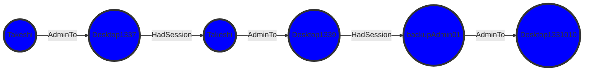

# MermaidGen

A quick proof of concept for creating mermaid diagrams for markdown as code. Inspired by Fabian Baders blog post on ["Find lateral movement paths using KQL Graph semantics"](https://cloudbrothers.info/en/find-lateral-movement-paths-kql-graph-semantics/).

## Current limitations

- Only supports linear flow diagrams
- Assumes that data is structured in the following way
    - Node1, Relationship, Node2, Relationship, Node3, ...

## Usage

### Example 1 - from CSV

```powershell
$Data = Parse-MermaidDataInput -DataPath .\exampledata1.csv -Delimiter ","
$Diagram = New-MermaidFlowDiagram -Data $Data
```

#### Output



### Example 2 - from custom text input

```powershell
$Data = Parse-MermaidDataInput -DataPath .\exampledata2.txt -Delimiter "-->"
$Diagram = New-MermaidFlowDiagram -Data $Data
```

#### Output


